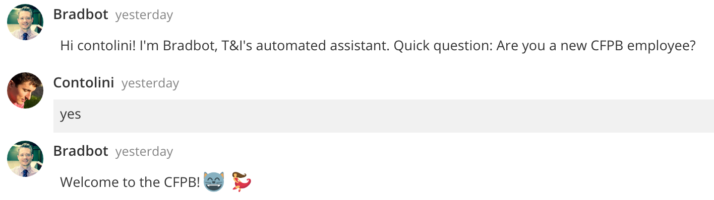

# hubot-onboarding [](https://travis-ci.org/cfpb/hubot-onboarding) [](https://www.npmjs.com/package/hubot-onboarding)

A [Hubot](https://hubot.github.com) script for welcoming new hires to your organization by gradually providing them scheduled information. Uses Google Docs as a backend to make maintenance as easy as updating a spreadsheet. Inspired by [Dolores Landingham](https://github.com/18F/dolores-landingham-bot).



Three features are provided out of the box:

1. **Message scheduler** - Send custom messages to new employees at set intervals
1. **Task manager** - Dynamically generated HTML checklist of to-dos with webhooks to allow event-driven messaging
1. **Glossary** - Saying certain keywords to the bot triggers custom responses

See [`src/index.coffee`](src/index.coffee) for documentation.
This project is in alpha and documentation will be improved as we enter beta.

## Installation

In hubot project repo, run:

`npm install hubot-onboarding --save`

Then add **hubot-onboarding** to your `external-scripts.json`:

```json
["hubot-onboarding"]
```

## Sample Interaction

*Coming soon.*

## Contributing

Please read our general [contributing guidelines](CONTRIBUTING.md).

## Open source licensing info
1. [TERMS](TERMS.md)
2. [LICENSE](LICENSE)
3. [CFPB Source Code Policy](https://github.com/cfpb/source-code-policy/)
